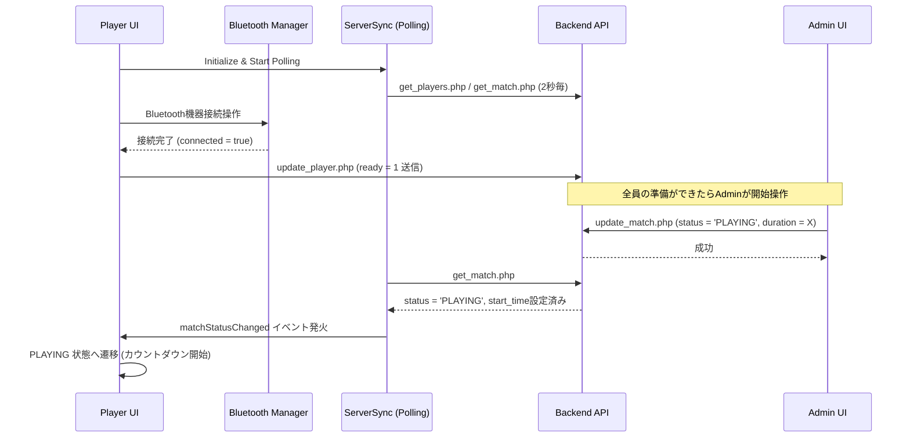
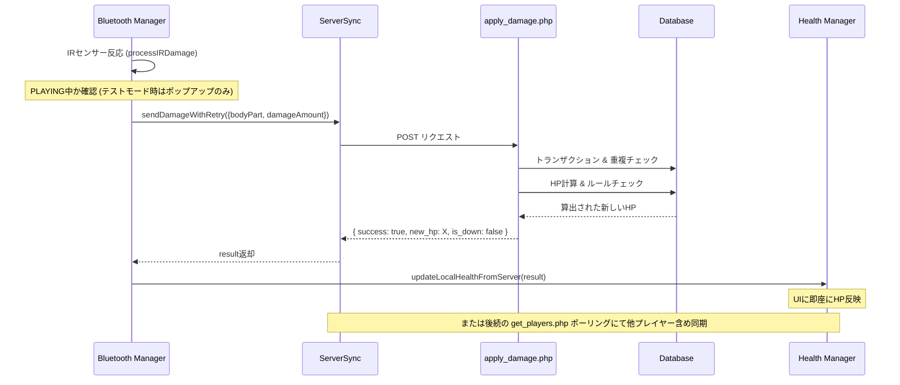
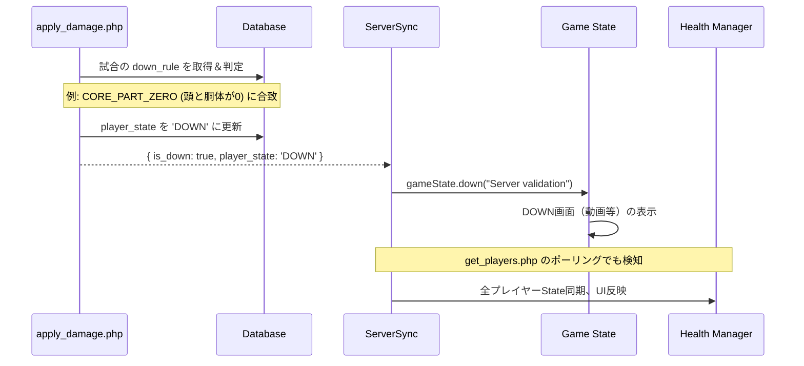
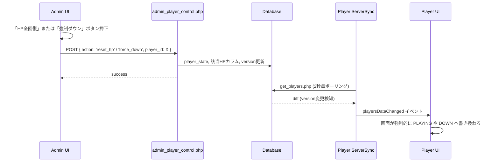
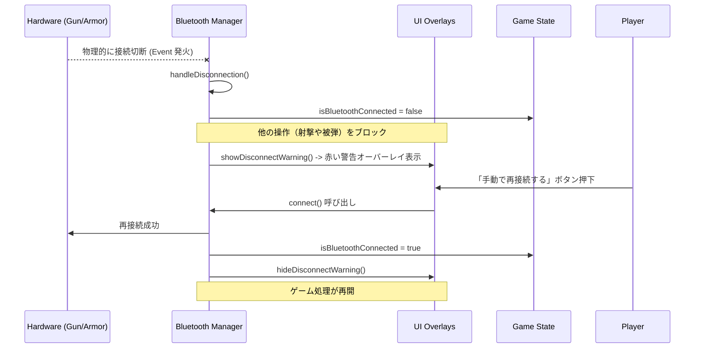
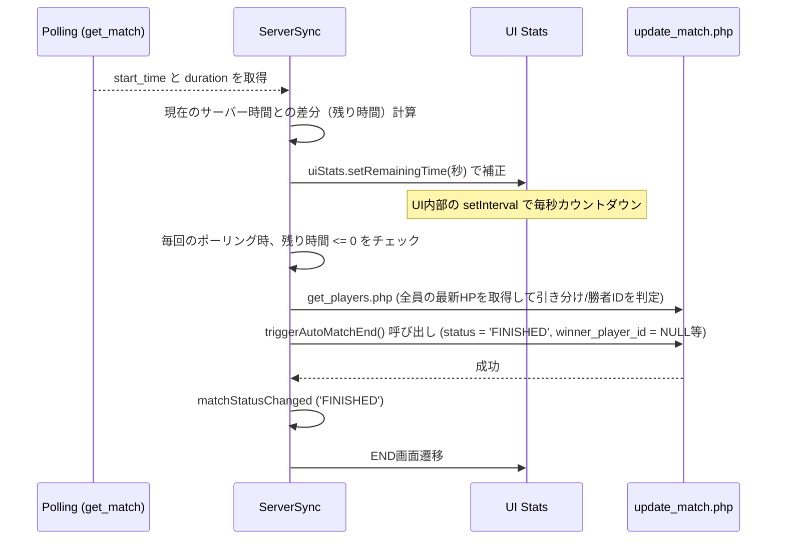
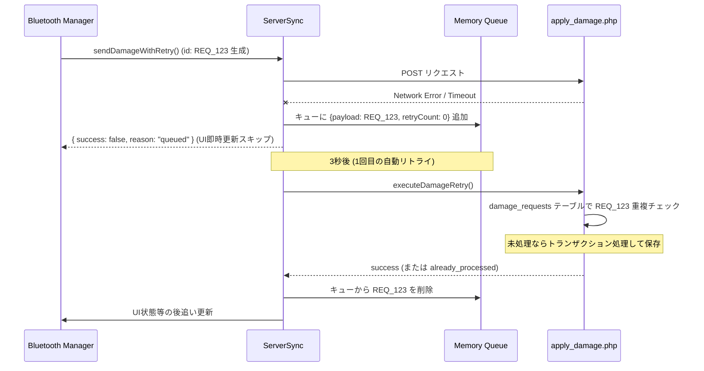
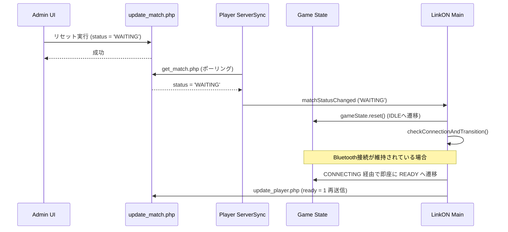

# 全体の処理フロー説明

SPEC-IR システムにおける主要なユースケースの処理フローをシーケンス図で解説します。

---

## 1. ゲーム開始までの流れ

接続からAdminが試合を開始するまでの準備フローです。

---

## 2. 被弾からHP反映までの流れ

赤外線被弾からダメージが反映されるまでのサーバー権威フローです。

---

## 3. DOWN判定からゲーム終了までの流れ

いずれかのルールの条件を満たし、サーバーでDOWN判定された際のフローです。

---

## 4. Admin操作の流れ

Adminが管理画面から特定プレイヤーのステータスを直接操作・補正するフローです。

---

## 5. Bluetooth切断・再接続の流れ

ハードウェアの通信が切れた際の安全保護ループです。

---

## 6. タイマー時間切れの流れ

クライアント側で時間を管理し、サーバーと同期しながら終了を主導するフローです。

---

## 7. 通信エラー・リトライの流れ

ネットワークが不安定な野外等でパケットロスが発生した場合のバックアップフローです。

---

## 8. リマッチ（再試合）の流れ

試合終了後からデバイスを切断せずに、そのまま次の試合へ移行する際のフローです。

